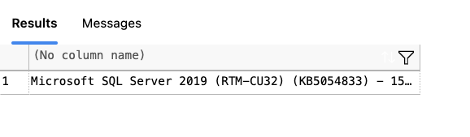

## Installation Steps

### 1. Install Docker
Download and install Docker Desktop from:  
👉 [https://www.docker.com/products/docker-desktop/](https://www.docker.com/products/docker-desktop/)

---

### 2. Pull the SQL Server Docker Image
Open Terminal and run:

```bash
docker pull mcr.microsoft.com/mssql/server:2019-latest
```

---

### 3. Run the SQL Server Container

```bash
docker run --platform linux/amd64 \
  -e 'ACCEPT_EULA=Y' -e 'SA_PASSWORD=ForSQL@123' \
  -p 1433:1433 --name sqlserver \
  -d mcr.microsoft.com/mssql/server:2019-latest
```

>**Note:** Replace `ForSQL@123` with a strong password of your choice.

---

### 4. Connect to SQL Server (in VS Code)

- Install the **SQL Server (mssql)** extension.
- Open the **Command Palette** (`Cmd + Shift + P`)
- Choose: `MS SQL: Connect`
- Configure with:
  - **Server**: `localhost`
  - **Authentication Type**: `SQL Login`
  - **User**: `sa`
  - **Password**: *(same as Step 3)*

---

### 5. Test the Connection

1. Open a `.sql` file in VS Code
2. Run the following query:

```sql
SELECT @@VERSION;
```

3. You should see output confirming the version of SQL Server:



---

Now the SQL Server is running on macOS via Docker and is ready to write and execute queries.

Everytime you close and resteart run the command 'docker start sqlserver' to start the server