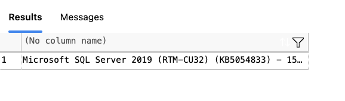

# 📘 SQL Notes

## **SQL (Structured Query Language)**
SQL is used to communicate with a database—primarily for querying, updating, and managing data.

---

## **DBMS & SQL Server**

**Database Management System (DBMS)** is software that handles requests made to the database. It manages:
- Execution priorities for SQL queries
- Access control and security
- Data consistency and concurrency

### ⭐️ Key Points:
- **Database**: Stores data  
- **SQL**: Language used to interact with the database  
- **DBMS**: Manages and organizes how the database operates  
- **Server**: The physical or cloud location where the database resides


---

## **Types of Databases**

### 1. **Relational Database**
- Structured like spreadsheets with rows and columns.
- Relationships exist between tables.
- 📌 Examples: `Microsoft SQL Server`, `MySQL`, `PostgreSQL`

### 2. **Key-Value Store**
- Stores data as key-value pairs (like a dictionary).
- Highly performant for simple queries.
- 📌 Examples: `Redis`, `Amazon DynamoDB`

### 3. **Column-Based Database**
- Data is stored and queried by columns rather than rows.
- Efficient for large-scale data and analytics workloads.
- 📌 Examples: `Apache Cassandra`, `Amazon Redshift`

### 4. **Graph-Based Database**
- Designed to represent and query relationships between entities.
- Ideal for social networks, recommendation systems, etc.
- 📌 Example: `Neo4j`

### 5. **Document-Oriented Database**
- Stores data as JSON-like documents.
- Schema-flexible; each document can have a different structure.
- 📌 Example: `MongoDB`


> **📝 Note:**  
> - **Relational Databases** are often referred to as **SQL Databases**.  
> - The rest (Key-Value, Column-Based, Graph, Document) are commonly grouped as **NoSQL Databases**.

---
---

## **Database Structure**

Databases follow a hierarchical structure:

1. **Server**: The starting point. A server can host **multiple databases**.
2. **Database**: Each database can contain **multiple schemas**.
3. **Schema**: A logical container that groups related objects like tables, views, etc.
4. **Table**: 
   - Think of a table like a spreadsheet with **rows** (records) and **columns** (fields).
   - **Columns** define the type of data (e.g., Name, Date, Price).
   - **Rows** store the actual data.
   - One column is typically designated as the **Primary Key**, a unique identifier for each row.
   - Each column has a specific **data type**: `INTEGER`, `VARCHAR`, `DATETIME`, etc.


---

## **Types of SQL Commands**

SQL commands are grouped into different categories:

### 🔹 **DDL (Data Definition Language)**
Used to define and modify database structures like tables and schemas.

- `CREATE`: Create new tables or objects
- `ALTER`: Modify existing structures
- `DROP`: Delete tables or structures

### 🔹 **DML (Data Manipulation Language)**
Used to manipulate the data stored inside tables.

- `INSERT`: Add new records
- `UPDATE`: Modify existing records
- `DELETE`: Remove records

### 🔹 **DQL (Data Query Language)**
Used to query and retrieve data.

- `SELECT`: Ask questions to the database and retrieve answers (records)

---

## **Why Are We Learning SQL?**

1. **To Talk to Data**: SQL is the universal language to interact with data.
2. **High Demand**: Almost every company using data relies on SQL.
3. **Industry Standard**: SQL is foundational in Data Science, Analytics, and Engineering.

---

## 🔧 Installation Steps

### 1. Install Docker
Download and install Docker Desktop from:  
👉 [https://www.docker.com/products/docker-desktop/](https://www.docker.com/products/docker-desktop/)

---

### 2. Pull the SQL Server Docker Image
Open Terminal and run:

```bash
docker pull mcr.microsoft.com/mssql/server:2019-latest
```

---

### 3. Run the SQL Server Container

```bash
docker run --platform linux/amd64 \
  -e 'ACCEPT_EULA=Y' -e 'SA_PASSWORD=ForSQL@123' \
  -p 1433:1433 --name sqlserver \
  -d mcr.microsoft.com/mssql/server:2019-latest
```

>**Note:** Replace `ForSQL@123` with a strong password of your choice.

---

### 4. Connect to SQL Server (in VS Code)

- Install the **SQL Server (mssql)** extension.
- Open the **Command Palette** (`Cmd + Shift + P`)
- Choose: `MS SQL: Connect`
- Configure with:
  - **Server**: `localhost`
  - **Authentication Type**: `SQL Login`
  - **User**: `sa`
  - **Password**: *(same as Step 3)*

---

### 5. Test the Connection

1. Open a `.sql` file in VS Code
2. Run the following query:

```sql
SELECT @@VERSION;
```

3. You should see output confirming the version of SQL Server:



---

Now the SQL Server is running on macOS via Docker and is ready to write and execute queries.