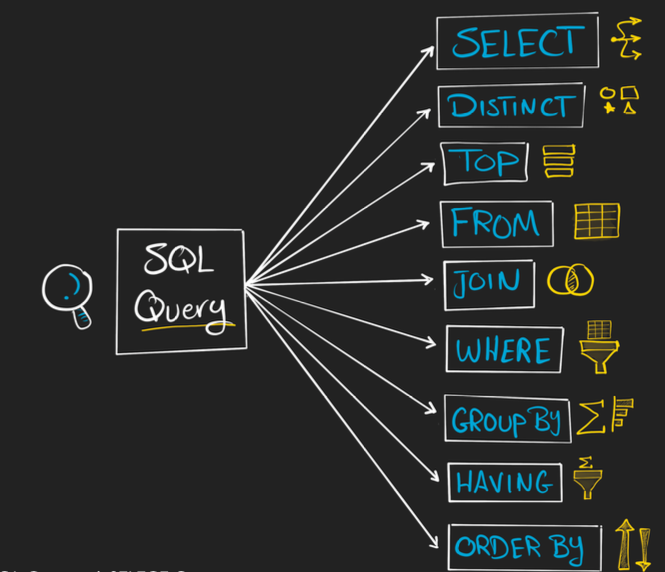

# Querying Data with SELECT

The `SELECT` statement is used to **read data from a database**. It allows us to ask specific questions about the data by using different **SQL clauses**, also known as query components.



---

## SQL Query Components

Each SQL query can include a combination of these clauses:

- `SELECT`
- `DISTINCT`
- `TOP`
- `FROM`
- `JOIN`
- `WHERE`
- `GROUP BY`
- `HAVING`
- `ORDER BY`

---

## Basic Query Examples

### Select All Columns

```sql
SELECT *
FROM Table;
```

- `SELECT *` retrieves all columns.
- `FROM` specifies the table to read data from.

---

### Select Specific Columns

```sql
SELECT
    Col1,
    Col2
FROM Table;
```

- Selects only the required columns (more efficient than using `*`).

---

### WHERE Clause – Filtering Rows

```sql
SELECT *
FROM Table
WHERE score > 500;
```

- Filters rows based on a condition.
- Used **before aggregation**.

---

### ↕️ ORDER BY – Sorting Results

```sql
SELECT *
FROM Table
ORDER BY column_name ASC; -- Default is ASC
```

#### Nested `ORDER BY` (Multiple Columns):

```sql
SELECT *
FROM Table
ORDER BY
    column1 ASC,
    column2 DESC;
```

---

### GROUP BY – Aggregation

Groups rows with the same value and performs aggregations.

```sql
SELECT
    category1,
    SUM(category2) AS total
FROM Table
GROUP BY category1;
```

---

### HAVING – Post-Aggregation Filtering

```sql
SELECT
    category1,
    SUM(category2)
FROM Table
GROUP BY category1
HAVING SUM(category2) > 100;
```

- Similar to `WHERE` but used **after** grouping and aggregation.

**Tip**:  
- Use `WHERE` **before** aggregation  
- Use `HAVING` **after** aggregation

---

### DISTINCT – Remove Duplicates

```sql
SELECT DISTINCT column_name
FROM Table;
```

- Ensures each value is unique in the output.
- Can be **computationally expensive**.

---

### TOP – Limit Output Rows

```sql
SELECT TOP 5 *
FROM Table;
```

- Restricts the number of rows returned.
- Useful when combined with `ORDER BY`.

---

## SQL Execution Order vs Coding Order

Understanding how SQL actually processes your query is crucial for writing efficient and accurate queries.

### Execution Order (Logical)

| Step | Clause      | Purpose                                                   |
|------|-------------|-----------------------------------------------------------|
| 1️   | `FROM`      | Load data from source                                     |
| 2️   | `WHERE`     | Filter rows **before** grouping                          |
| 3️   | `GROUP BY`  | Group rows based on columns                              |
| 4️   | `HAVING`    | Filter grouped data                                      |
| 5️   | `SELECT`    | Choose columns to return (can include aggregates)        |
| 6️   | `ORDER BY`  | Sort the final result                                     |
| 7️   | `TOP`       | Limit the number of rows returned                         |

---

###  Coding Order (How we Write It)

```sql
SELECT DISTINCT TOP 2
    Col1,
    SUM(Col2)
FROM Table
WHERE Col1 = 10
GROUP BY Col1
HAVING SUM(Col2) > 30
ORDER BY Col1 ASC;
```

 Even though `SELECT` is written first, it's executed later in the process.

---

With these components and understanding of execution order, we can construct efficient, powerful SQL queries.
