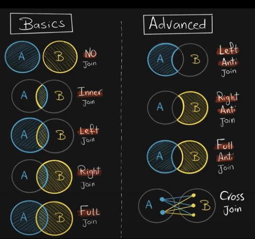

# SQL Joins

Joining is the process of combining **columns** from two or more tables using a common key.

---

## What Are SQL Joins?

SQL Joins connect rows from two tables based on a related column, helping to:

1. **Recombine Data (Big Picture)**  
   Example: Customer data might be spread across tables like orders, reviews, addresses, etc.

2. **Data Enrichment**  
   Use reference or lookup tables to add extra information.

3. **Existence Check / Filtering**  
   Validate the existence or non-existence of records in another table.


---

## Join Types

- **No Join**
- **INNER JOIN**
- **LEFT JOIN**
- **RIGHT JOIN**
- **FULL JOIN**



---

### 1. No Join

Returns results from both tables separately (not an actual join).

```sql
SELECT * FROM A;
SELECT * FROM B;
```

---

### 2. INNER JOIN

Returns only the rows with matching keys in both tables.

```sql
SELECT *
FROM A
INNER JOIN B
ON A.key = B.key;
```

#### Notes:
- `INNER JOIN` is the default type if unspecified.
- The order of tables **does not** affect the result.
- Always specify the join type for clarity.

#### Avoiding Column Ambiguity:
Use table aliases or prefixes if columns in both tables have the same name.

#### Use Cases:
- Data recombination
- Filtering based on presence in both tables

---

### 3. LEFT JOIN

Returns all rows from the **left** table and only the matching rows from the **right**.

```sql
SELECT *
FROM A
LEFT JOIN B
ON A.key = B.key;
```

- **A** is the primary data source.
- **B** is supplementary.

#### Use Cases:
- Full view of data (even if no match in B)
- Data enrichment
- Existence checking (with `WHERE` clause)

---

### 4. RIGHT JOIN

Returns all rows from the **right** table and only the matching rows from the **left**.

```sql
SELECT *
FROM A
RIGHT JOIN B
ON A.key = B.key;
```

- **B** is the primary data source.
- **A** is supplementary.

---

### 5. FULL JOIN

Returns all rows from both tables, matched where possible.

```sql
SELECT *
FROM A
FULL JOIN B
ON A.key = B.key;
```

- **Order of tables does not matter**

#### Use Cases:
- Combine all available data
- Detect missing or unmatched entries in either table
