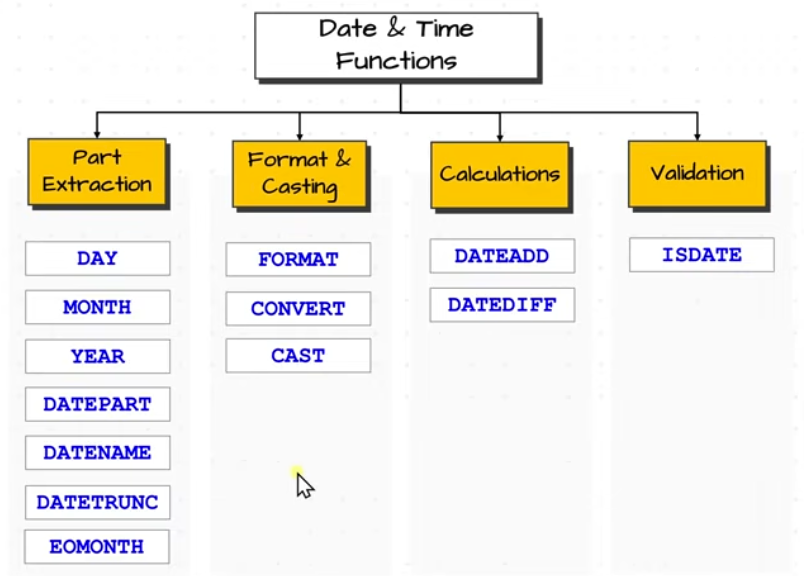

# SQL Functions

SQL Functions are built-in operations that take input values, process them, and return an output. They enhance querying capabilities by allowing calculations, transformations, and conditional logic within queries.

---

## Categories of SQL Functions

SQL functions fall into two main types:

### 1. Single-Row Functions
- Operate on **one row at a time**.
- Return **one result per input row**.
- Types:
  - String Functions
  - Date & Time Functions
  - Numeric Functions
  - Null Functions

### 2. Multi-Row Functions
- Operate on **multiple rows**.
- Return **one aggregated result**.
- Types:
  - Aggregate Functions (Basic)
  - Window Functions (Advanced)

---

## Nested Functions

Functions can also be **nested** — i.e., using one function inside another for compound operations.

---

## String Functions

### Manipulation
- **`CONCAT()`** – Combines multiple string values.
- **`UPPER()`** – Converts text to uppercase.
- **`LOWER()`** – Converts text to lowercase.
- **`TRIM()`** – Removes leading and trailing spaces.
- **`REPLACE()`** – Replaces a substring with another.

### Calculation
- **`LEN()`** – Returns the number of characters in a string (works on any datatype).

### Extraction
- **`LEFT(str, n)`** – Extracts the first *n* characters.
- **`RIGHT(str, n)`** – Extracts the last *n* characters.
- **`SUBSTRING(str, start, length)`** – Extracts a substring from a specific position.

---

## Numeric Functions

- **`ROUND(value, decimal_places)`** – Rounds the number.
- **`ABS(value)`** – Returns the absolute value.

---

## Date & Time Functions

Date information can be:
- Selected from a column.
- Hardcoded as a string.
- Retrieved using the `GETDATE()` function.

You can:
- Extract parts of a date.
- Change the format of a date.
- Perform date calculations.
- Validate date values.

### Function Categories:

---

### 1. Part Extraction

| Function       | Description                                    | Returns   |
|----------------|------------------------------------------------|-----------|
| `DAY(date)`     | Returns day                                    | `INT`     |
| `MONTH(date)`   | Returns month                                  | `INT`     |
| `YEAR(date)`    | Returns year                                   | `INT`     |
| `DATEPART(part, date)` | Extracts a date part (e.g. `month`)     | `INT`     |
| `DATENAME(part, date)` | Returns name of part (e.g. 'Monday')   | `STRING`  |
| `DATETRUNC(part, date)` | Truncates date to specified part      | `DATE` or `DATETIME` |
| `EOMONTH(date)` | Returns end of month for given date            | `DATE`    |

---

### 2. Format & Casting

- **`FORMAT(value, format[, culture])`** – Format dates and numbers.
- **`CONVERT(datatype, value, style)`** – Convert and style formats using numeric style codes.
- **`CAST(value AS datatype)`** – Change the data type.

---

### 3. Calculations

- **`DATEADD(part, number, date)`** – Adds interval to a date.
- **`DATEDIFF(part, start_date, end_date)`** – Difference between two dates.

---

### 4. Validation

- **`ISDATE(value)`** – Returns 1 if the value is a valid date, else 0.

---

## Best Practices (Date & Time)

- Prefer **integers** over strings for better performance.
- Avoid using `DATENAME()` in filtering — use `DATEPART()` instead for better efficiency.

---

## SQL Date Functions & Return Types

| Function       | Purpose                                      | Returns     |
|----------------|----------------------------------------------|-------------|
| `DATEPART()`   | Extracts part of date                        | `INT`       |
| `DATENAME()`   | Returns name of part (e.g., 'Monday')        | `STRING`    |
| `DATETRUNC()`  | Truncates date to part (e.g., start of month)| `DATETIME`  |
| `EOMONTH()`    | End of the month                             | `DATE`      |

> `DATETRUNC()` may not be available in older SQL Server versions. Alternatives: `FORMAT()` or `DATEFROMPARTS()`.

---

## Set Operator Recap in Functions Context

- Use `UNION` / `UNION ALL` to combine string/date results across sources.
- Use `DATEADD`, `DATEDIFF`, `EOMONTH`, etc., in analysis over periods.
